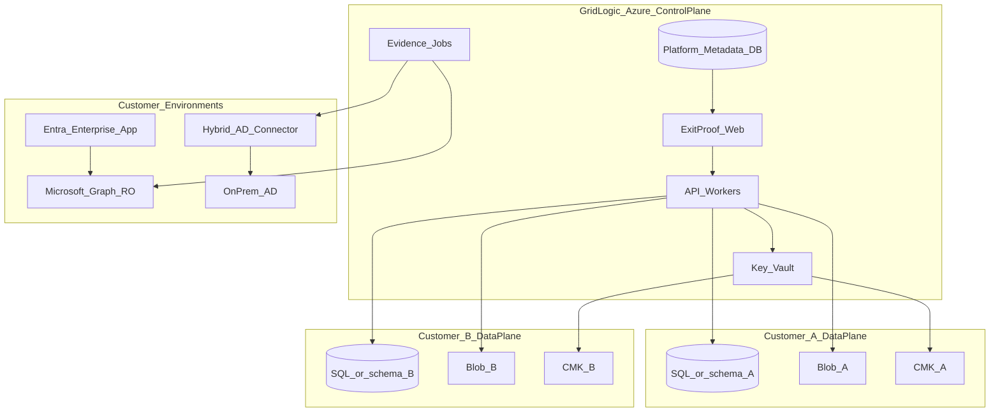

# ExitProof × GridLogic — Product & Security Charter

**Status:** Active (Phases 0–6 in-repo complete; live Azure pen-test / deploy still open)  
**Owner:** GridLogic IT / ExitProof product  
**Last updated:** 2026-07-23

## Charter statement

**Product:** ExitProof remains the audit-ready offboarding / access-evidence product.  
**Go-to-market:** Sold by **GridLogic IT** as a **managed service package** (GridLogic provisions, operates, and supports; customer consumes a compartmentalized workspace).  
**Security bar:** Treat every customer as a high-sensitivity tenant (offboarding evidence, directory exports, Graph audit data). Default assumption: **no customer may ever read another customer’s data**—enforced by architecture, not UI convention.

This charter supersedes the current Vercel + Supabase “Agency parent/child” SaaS shape for **production GridLogic sales**. Existing checklist, framework, and Evidence Pack work is **retained and ported**.

> Production target for GridLogic-sold ExitProof is **Microsoft Azure**, operated by GridLogic. The current Vercel/Supabase stack remains valid for local demo and transitional development until Phase 1 migration completes.

---

## Locked architecture decisions

| Decision | Lock |
|----------|------|
| Operator | GridLogic IT (managed package); customers do not self-host unless Premium Dedicated |
| Cloud home | **Microsoft Azure** (aligns with Entra/Graph; drop Vercel/Supabase as production target over time) |
| Default tenancy | **Shared platform, hard logical isolation** (one app, one control plane, per-customer data plane keys) |
| High-assurance SKU | **Dedicated** resource group per customer (Container Apps + Azure SQL + storage + Key Vault) for CMMC/FedRAMP-sensitive buyers |
| Customer cloud access | Per-customer **Entra Enterprise Application** consent to GridLogic multi-tenant app; **Microsoft Graph read-only** first |
| On-prem AD | **Outbound-only Hybrid Connector** (Windows service) in customer network; cert-authenticated; read-only LDAP/AD |
| Auto evidence | Optional jobs that snapshot Graph/AD into hashed evidence attachments—never silent write/disable in v1 |
| Write/disable to IdP | **Out of charter v1–v2** (manual checklist remains source of truth for revocation actions) |

**Why not Azure Functions-only or a single VM:** Functions alone are awkward for long-lived Next.js UI + connector agent protocol; a single shared VM is a blast-radius nightmare. Prefer **Azure Container Apps** (web) + **Container Apps Jobs / Azure Functions** (crons/connectors) + **Azure SQL** + **Blob** + **Key Vault**. VMs are not the primary design—only optional jump hosts or connector build agents.

See ADRs:

- [ADR-001: Tenancy and Azure platform](adr/001-tenancy-and-azure.md)
- [ADR-002: Graph read-only and AD Hybrid Connector](adr/002-graph-readonly-and-ad-connector.md)
- [ADR-003: Graph write-path deferred](adr/003-graph-write-path-deferred.md) — Phase 7 dual-control disable/revoke; out of scope for Phases 0–6

---

## High-level architecture

---

## Part I — Secure customer setup & compartmentalization

### I.1 Tenant provisioning model (GridLogic runbook)

For each sold package, GridLogic runs a **Provision Customer** workflow (CLI/portal, not manual SQL):

1. Create `tenant_id` (immutable UUID) + customer metadata in **platform DB only**
2. Allocate data plane:
   - **Standard:** dedicated Azure SQL schema + blob container prefix `tenants/{id}/` + Key Vault key `cmk-{id}`
   - **Dedicated SKU:** new resource group `rg-exitproof-{customer}` with isolated App (optional), SQL server, storage account, Key Vault
3. Issue **tenant encryption key** (CMK); all evidence blobs and sensitive columns encrypted with that key
4. Bind customer Entra **tenant ID** (required)—replace insecure email-domain JIT
5. Create GridLogic break-glass admin (time-boxed, audited) + customer owner invite
6. Emit onboarding checklist: consent Graph app, optional install Hybrid Connector, SSO enforce

### I.2 Hard isolation controls (Standard shared platform)

| Layer | Requirement |
|-------|-------------|
| Identity | Every request carries `tenant_id` from session claims; never from client body alone |
| Data | Row-level filters / RLS on **all** tables; no cross-tenant queries; ban global service-role reads of evidence |
| Secrets | Per-tenant Graph certs/secrets in Key Vault; workers assume managed identity + get secret by tenant |
| Storage | Separate container or prefix + SAS/user delegation scoped to tenant; no public blobs |
| Network | Private endpoints for SQL/Blob/Key Vault; web via WAF (Front Door/App Gateway); deny public SQL |
| AuthZ | Customer users only see their tenant; GridLogic staff require **explicit JIT access** with ticket ID + expiry + full audit |
| Logging | Structured logs with `tenant_id`; never log tokens, PII dumps, or Graph payloads in cleartext |
| Backup | Per-tenant restore capability; backups encrypted; restore drills quarterly |

### I.3 Threats to eliminate (vs today’s app)

- Domain-based JIT org join (`lib/org-bootstrap.ts`)
- Agency parent auto-seeing all child evidence without customer consent model
- Broad Supabase service-role usage for routine paths (`lib/supabase/admin.ts`)
- Unused `entra_tenant_id`
- Production footgun of `DEMO_MODE` / missing keys

### I.4 Deployment recommendation

| Component | Choice |
|-----------|--------|
| Web + API | Azure Container Apps (or App Service) running Next.js (Node 20+) |
| Async / cron | Container Apps Jobs or Azure Functions (NCRONTAB) for overdue, retention, Graph sync |
| DB | Azure SQL (Standard) with `tenant_id` + RLS-equivalent policies; Dedicated SKU = separate server |
| Files | Azure Blob + CMK |
| Secrets | Azure Key Vault |
| Auth | Entra External ID / CIAM **or** migrate off Supabase to Entra-backed sessions (MSAL) over Phase 2–3 |
| CDN/WAF | Azure Front Door |
| Observability | App Insights + Log Analytics; tenant-scoped dashboards for GridLogic NOC |
| IaC | Bicep or Terraform; `modules/tenant-standard` + `modules/tenant-dedicated` |

---

## Part II — Customer environment connectivity

### II.1 Microsoft cloud (Entra + Graph) — read-only audit

**Pattern:** GridLogic registers a **multi-tenant Entra application**. Each customer admin consents (admin consent URL), creating an Enterprise Application in *their* tenant.

**v1 Graph permissions (application, least privilege for offboarding audit):**

- `User.Read.All` — account enabled/disabled, licenses
- `Directory.Read.All` or narrower group/role reads as needed
- `AuditLog.Read.All` / `DirectoryAudits.Read.All` — disable/delete events
- `UserAuthenticationMethod.Read.All` — MFA method presence (optional, sensitive)
- `Device.Read.All` — device ownership (optional)

**Explicitly not in early phases:** `User.ReadWrite.All`, mailbox wipe, Intune wipe. **No Graph write until Phase 7** (separate charter).

### II.2 On-prem Active Directory — Hybrid Connector

**Pattern:** Small **Windows service** (“ExitProof Connector”) installed by GridLogic on a domain-joined management server.

| Property | Spec |
|----------|------|
| Direction | **Outbound HTTPS only** to GridLogic endpoint (no inbound firewall holes) |
| Auth | Client certificate (mTLS) issued at provisioning; rotated |
| Access | Read-only LDAP/AD (userAccountControl, memberOf, lastLogon, computer objects) |
| Scope | Configurable OUs; deny DC replication rights |
| Data | Minimal attributes; no password hashes; optional local redact |
| Ops | Auto-update channel; heartbeats; GridLogic can revoke cert instantly |

### II.3 Automatic evidence collection (optional per tenant)

Flag `auto_evidence_enabled` on tenant:

- On checklist step open or on schedule: run connector job → store blob → link to step → audit event `evidence.auto_collected`
- Human still confirms critical steps (or policy: auto-complete only non-critical)
- Never claim certification; label “system-collected snapshot”

---

## Part III — Phased delivery

Horizon: **~6–9 months** calendar for full charter if one focused team. Each phase is shippable revenue value.

| Phase | Focus | Exit criteria (summary) |
|-------|--------|-------------------------|
| **0** | Threat model, SKUs, DPA notes, ADRs, this charter | Signed threat model + SKU sheet + architecture ADR |
| **1** | Azure spine + hard `tenant_id` isolation; kill domain JIT | Two synthetic tenants cannot read each other’s data |
| **2** | GridLogic operator console, JIT staff access, onboard wizard | Onboard Standard customer in &lt;1 hour without SQL — **shipped** (`/operator`, migration `008_operator_jit`) |
| **3** | Entra multi-tenant app + Graph RO snapshots / mismatch UI | Lab: consent → snapshot → hashed evidence |
| **4** | Hybrid AD connector (outbound mTLS) | Lab AD detect + pack includes AD export |
| **5** | Auto-evidence policies & Evidence Pack v3 | System vs human evidence; attest-on-critical — **shipped** (`lib/evidence/`, migration `010`, Pack v3 sections) |
| **6** | Pen test, CI/CD, DR, platform SOC 2 path | Controls tested; RPO/RTO defined |
| **7** | *(Deferred — future charter)* Graph write / disable with dual-control | Only after RO trust; see [ADR-003](adr/003-graph-write-path-deferred.md) |

Supporting docs for Phase 0:

- [Threat model (STRIDE)](security/threat-model.md)
- [Commercial SKUs](commercial/skus.md)
- [DPA / consent / subprocessor notes](commercial/dpa-notes.md)

---

## Part IV — Security control matrix (platform)

| Control | Implementation |
|---------|----------------|
| Tenant isolation | `tenant_id` + SQL policies + storage prefix + CMK |
| Encryption | TLS 1.2+; CMK at rest; no plaintext secrets in DB |
| Access | Entra SSO; MFA required for GridLogic operators; customer SSO-enforce option |
| Privilege | Least-privilege Graph; connector read-only AD |
| Audit | Immutable audit_events; operator JIT access logged |
| Supply chain | Signed connector builds; Dependabot/CI |
| Incident | Per-tenant kill switch (disable connectors + freeze logins) |

**Data classification:** Evidence attachments and directory exports are **Restricted**. See [threat model](security/threat-model.md).

---

## Part V — GridLogic service package packaging

| SKU | Includes |
|-----|----------|
| ExitProof Standard | Shared Azure tenancy, frameworks/Evidence Pack, Entra SSO, GridLogic onboarding |
| ExitProof Dedicated | Isolated RG, optional private networking, higher retention |
| Add-on: Cloud Directory Audit | Graph consent + snapshots + optional auto-evidence |
| Add-on: Hybrid AD Audit | Connector + AD snapshots + mismatch alerts |
| Add-on: Auto-evidence | Policy-driven system collection into hashed attachments |
| Add-on: Managed Evidence Ops | GridLogic runs monthly access reviews / QBR packs |

Details: [docs/commercial/skus.md](commercial/skus.md).

Commercial ops: PSA/CRM ticket templates, SOW language, RACI (GridLogic vs customer IT)—owned by GridLogic sales/ops.

---

## Part VI — Relationship to current codebase

**Keep / port:** templates, compliance crosswalk (`lib/compliance/`), case/evidence UX, PDF packs, Stripe or replace with GridLogic billing later.

**Replace / redesign:** Supabase Auth → Entra-centric sessions; Supabase RLS → Azure SQL tenancy; Vercel crons → Azure Jobs; Agency-as-security-boundary → GridLogic operator + customer tenants (Agency plan remains a legacy commercial option); org-bootstrap domain JIT → explicit provision + Entra tenant bind.

**Repo strategy:** Continue in `exitproof` with this charter + ADRs; optional monorepo later (`apps/web`, `apps/worker`, `apps/connector`).

---

## Success metrics

1. Pen test: zero cross-tenant data access
2. GridLogic onboarding time &lt; 1 hour Standard
3. Graph + AD read-only producing auto-evidence on ≥3 mapped controls
4. Customer cannot see another tenant even via crafted IDs
5. Connector revoke stops AD sync within 5 minutes

## Non-goals (this charter)

- Customer self-serve marketplace install without GridLogic
- Full IGA / SCIM write automation in Phases 0–6
- FedRAMP ATO for ExitProof itself (separate program)
- Replacing customer’s PAM/IdP

---

## Document index

| Doc | Purpose |
|-----|---------|
| [CHARTER.md](CHARTER.md) | This document |
| [adr/001-tenancy-and-azure.md](adr/001-tenancy-and-azure.md) | Shared hard isolation + Dedicated SKU + Azure stack |
| [adr/002-graph-readonly-and-ad-connector.md](adr/002-graph-readonly-and-ad-connector.md) | Graph RO + Hybrid Connector; no write until Phase 7 |
| [adr/003-graph-write-path-deferred.md](adr/003-graph-write-path-deferred.md) | Phase 7 Graph write/disable deferred; criteria to open future charter |
| [security/threat-model.md](security/threat-model.md) | STRIDE multi-tenant + connectors; evidence = Restricted |
| [security/secret-scanning.md](security/secret-scanning.md) | CI, Dependabot, secret scanning notes (Phase 6) |
| [security/dr-runbook.md](security/dr-runbook.md) | RPO/RTO, restore, tenant wipe/offboard |
| [security/key-rotation.md](security/key-rotation.md) | Key rotation + AD cert revoke drills |
| [security/kill-switch.md](security/kill-switch.md) | Per-tenant freeze logins / disable connectors |
| [security/soc2-readiness.md](security/soc2-readiness.md) | Platform SOC 2 readiness stub for GridLogic hosting |
| [commercial/skus.md](commercial/skus.md) | Standard / Dedicated / add-ons |
| [commercial/dpa-notes.md](commercial/dpa-notes.md) | DPA / admin consent / subprocessor checklist for counsel |
