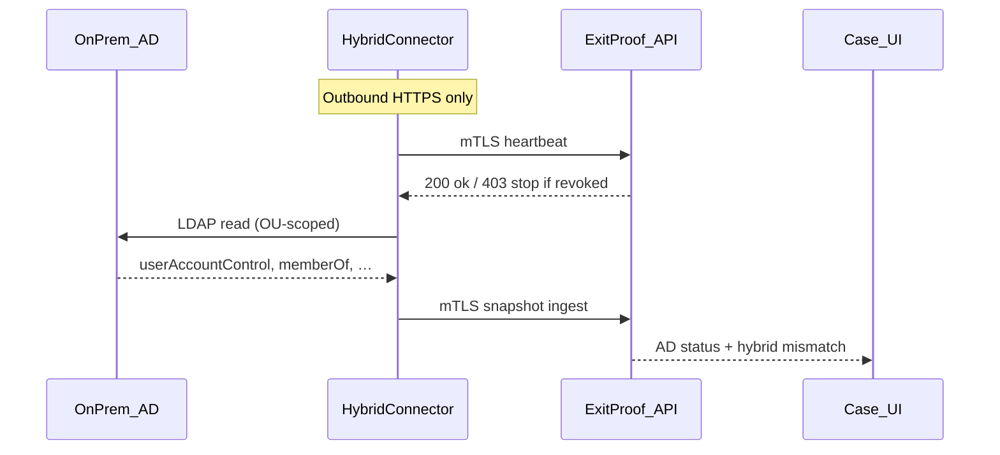

# Hybrid AD Connector — agent protocol

**Status:** Phase 4 foundation  
**Related:** [ADR-002](../adr/002-graph-readonly-and-ad-connector.md), [CHARTER](../CHARTER.md), connector package [`apps/connector/`](../../apps/connector/)

## Goals

- Collect **read-only** on-prem Active Directory account state for offboarding audit
- Prefer **outbound HTTPS only** (no inbound firewall holes into the customer network)
- Authenticate with **mutual TLS (client certificates)** so GridLogic can **revoke** access instantly
- Never collect **password hashes** or other secret material
- Scope queries to configured **OUs**

## Architecture



## Transport

| Property | Spec |
|----------|------|
| Direction | Agent → Platform only |
| Protocol | HTTPS (TLS 1.2+) |
| Auth | Client certificate (mTLS) + registration bearer token |
| Endpoints | `/api/connectors/ad/register`, `/heartbeat`, `/snapshots` |
| Inbound | **None** — agent does not open ports |

Production: Azure Front Door / App Gateway terminates mTLS and forwards a verified thumbprint. Until that wiring lands, the agent sends stub headers:

- `X-ExitProof-Connector-Id`
- `X-ExitProof-Cert-Thumbprint` (SHA-256 hex, lowercase, no colons)
- `Authorization: Bearer <registration_token>`

Platform validates thumbprint + token hash against `ad_connectors` for the **registered tenant** — `tenant_id` in the JSON body must match the connector row (never trust body alone).

## Certificate lifecycle

1. **Issue** — GridLogic provision mints a client cert + registration token bound to `tenant_id`
2. **Register** — `POST /api/connectors/ad/register` (provision secret) stores thumbprint + token hash
3. **Operate** — agent heartbeats; snapshots ingest under that identity
4. **Rotate** — issue new cert, register, retire old thumbprint
5. **Revoke** — set `ad_connectors.status = revoked` + `revoked_at`; heartbeats return `403` with `{ "stop": true }`; agent must exit within the next heartbeat interval (target ≤5 minutes)

Revoking the cert in Key Vault / CA + DB row is mandatory for incident response. Ops drill checklist: [key-rotation.md](../security/key-rotation.md). Tenant-wide freeze: [kill-switch.md](../security/kill-switch.md).

## OU scope

- Config: `EXITPROOF_OU_SCOPES` (comma-separated base DNs) and `ad_connectors.ou_scopes`
- Agent queries only under those bases
- Service account: **read-only**; deny DC replication / Domain Admin / Account Operators
- Platform rejects snapshots that include forbidden attributes (see below)

## Allowed vs forbidden attributes

**Allowed (minimal):**

- `sAMAccountName`, `userPrincipalName`, `objectGUID`
- `userAccountControl` (derive enabled/disabled from `ACCOUNTDISABLE`)
- `lastLogonTimestamp` / last logon
- `memberOf`, `distinguishedName`, `whenChanged`, `mail`

**Forbidden (must never collect or transmit):**

- `unicodePwd`, `userPassword`, `ntPwdHistory`, `lmPwdHistory`
- `supplementalCredentials`, `msDS-KeyMaterial`
- Any password hash, Kerberos key material, or credential blob

Platform `assertNoForbiddenAttributes` rejects ingest if these keys appear in `raw_attributes`.

## API sketches

### Register

`POST /api/connectors/ad/register`  
Auth: `CONNECTOR_PROVISION_SECRET` bearer (GridLogic ops)

```json
{
  "tenant_id": "…",
  "org_id": "…",
  "cert_thumbprint": "ab12…",
  "registration_token": "…",
  "ou_scopes": ["OU=Users,DC=contoso,DC=local"],
  "hostname": "MGMT01"
}
```

### Heartbeat

`POST /api/connectors/ad/heartbeat`  
Auth: mTLS stubs + registration token

```json
{
  "tenant_id": "…",
  "agent_version": "0.1.0",
  "hostname": "MGMT01",
  "metrics": { "ad_mode": "ldap" }
}
```

### Snapshot ingest

`POST /api/connectors/ad/snapshots`

```json
{
  "tenant_id": "…",
  "snapshots": [
    {
      "case_id": "…",
      "directory_key": "jordan.lee@contoso.com",
      "account_enabled": true,
      "user_account_control": 512,
      "member_of": ["CN=VPN-Users,…"],
      "cloud_account_enabled": false
    }
  ]
}
```

`hybrid_mismatch` is computed server-side when `cloud_account_enabled === false` and `account_enabled === true`.

## Hybrid mismatch alert

Shown on the case UI when **cloud (Entra) is disabled** but **on-prem AD is still enabled**. Manual checklist remains the source of truth for disable actions (write path is Phase 7).

## Auto-evidence (optional)

When `ad_auto_evidence_enabled` is on, `POST /api/connectors/ad/auto-evidence` attaches a system-collected CSV + SHA-256 to the auto-mapped checklist step (privileged AD groups / account disable). Labeled **system-collected snapshot**. Critical steps still require human attest (`require_human_attest_on_critical`, default true) — system evidence alone cannot mark them done.

## Demo / CI simulation

The Next.js demo store seeds:

- Connector `demo-ad-connector-1` with known token/thumbprint
- Snapshot for Jordan Lee: cloud disabled, AD enabled → mismatch alert on `/cases/demo-case-1`

The Node agent (`apps/connector`) defaults to `EXITPROOF_AD_MODE=mock` and posts the same shape without domain join.

## Installer

See [`apps/connector/INSTALL.md`](../../apps/connector/INSTALL.md) for PowerShell steps (MSI later).
